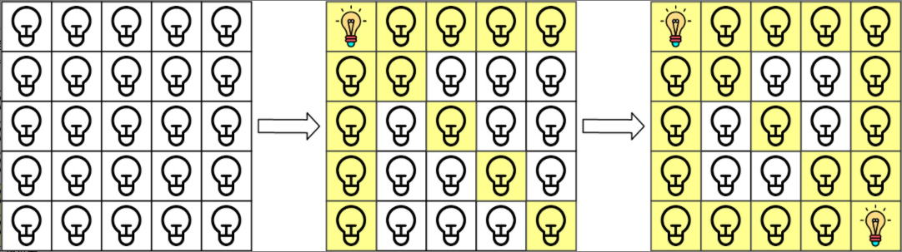
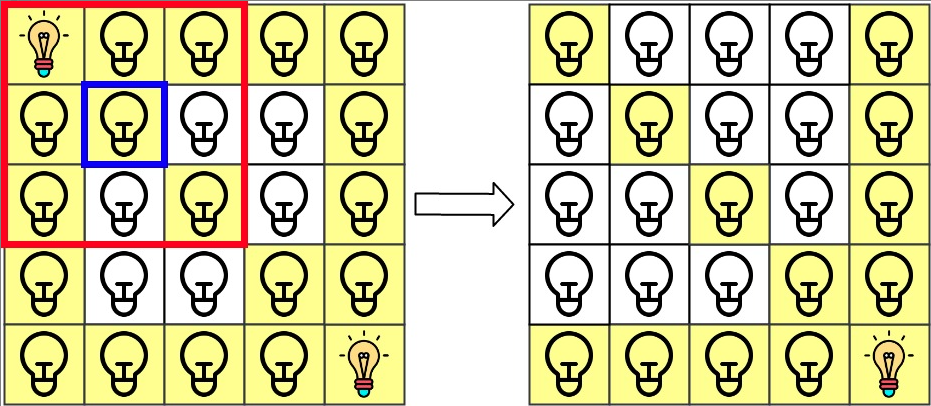
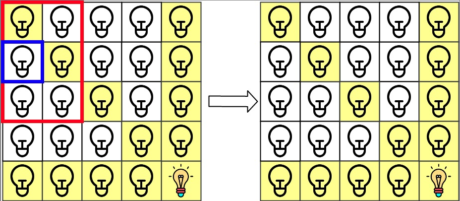

<h1>网格照明</h1>

在大小为n x n的网格grid上，每个单元格都有一盏灯，最初灯都处于关闭状态。 
给你一个由灯的位置组成的二维数组lamps，其中lamps[i] = [row[i], col[i]]表示打开位于grid[row[i]][col[i]]的灯。即便同一盏灯可能在lamps中多次列出，不会影响这盏灯处于打开状态。 
当一盏灯处于打开状态，它将会照亮自身所在单元格以及同一行、同一列和两条 对角线上的所有其他单元格。 
另给你一个二维数组queries，其中queries[j] = [row[j], col[j]]。对于第j个查询，如果单元格[row[j], col[j]]是被照亮的，则查询结果为1，否则为0。在第j次查询之后[按照查询的顺序]，关闭位于单元格grid[row[j]][col[j]]上及相邻8个方向上（与单元格grid[row[i]][col[i]]共享角或边）的任何灯。 
返回一个整数数组ans作为答案，ans[j]应等于第j次查询queries[j]的结果，1表示照亮，0表示未照亮。 

示例1： 
   
输入：n = 5, lamps = [[0, 0], [4, 4]], queries = [[1, 1], [1, 0]] 
输出：[1, 0] 
解释：最初所有灯都是关闭的。在执行查询之前，打开位于[0, 0]和[4, 4]的灯。第0次查询检查 grid[1][1]是否被照亮（蓝色方框）。该单元格被照亮，所以ans[0] = 1 。然后，关闭红色方框中的所有灯。 
   
第1次查询检查grid[1][0]是否被照亮（蓝色方框）。该单元格没有被照亮，所以ans[1] = 0。然后，关闭红色矩形中的所有灯。 
   

示例2： 
输入：n = 5, lamps = [[0, 0], [4, 4]], queries = [[1, 1], [1, 1]] 
输出：[1, 1] 

示例3： 
输入：n = 5, lamps = [[0, 0], [0, 4]], queries = [[0, 4], [0, 1], [1, 4]] 
输出：[1, 1, 0] 

提示：
- 1 <= n <= 10^9
- 0 <= lamps.length <= 20000
- 0 <= queries.length <= 20000
- lamps[i].length == 2
- 0 <= row[i], col[i] < n
- queries[j].length == 2
- 0 <= row[j], col[j] < n

[Link](https://leetcode-cn.com/problems/grid-illumination/)