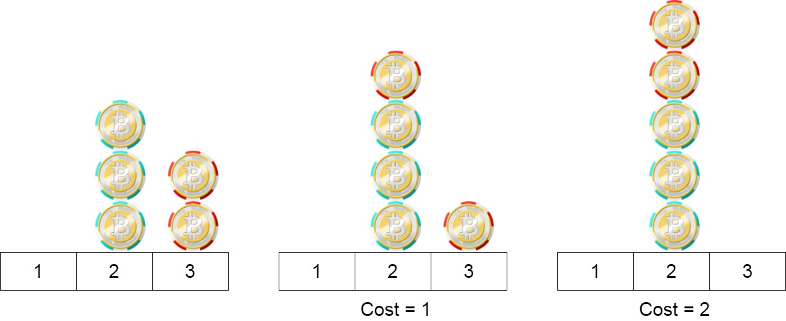

<h1>玩筹码</h1>

有n个筹码。第i个筹码的位置是position[i]。 
我们需要把所有筹码移到同一个位置。在一步中，我们可以将第i个筹码的位置从position[i]改变为: 
position[i] + 2或position[i] - 2，此时cost = 0 
position[i] + 1或position[i] - 1，此时cost = 1 
返回将所有筹码移动到同一位置上所需要的最小代价。 

示例1： 
   
输入：position = [1, 2, 3] 
输出：1 
解释：第一步:将位置3的筹码移动到位置1，成本为0。 
第二步:将位置2的筹码移动到位置1，成本= 1。 
总成本是1。 

示例2： 
   
输入：position = [2, 2, 2, 3, 3] 
输出：2 
解释：我们可以把位置3的两个筹码移到位置2。每一步的成本为1。总成本 = 2。 

示例3: 
输入：position = [1, 1000000000] 
输出：1 

提示：
- 1 <= chips.length <= 100
- 1 <= chips[i] <= 10^9

[Link](https://leetcode.cn/problems/minimum-cost-to-move-chips-to-the-same-position/)