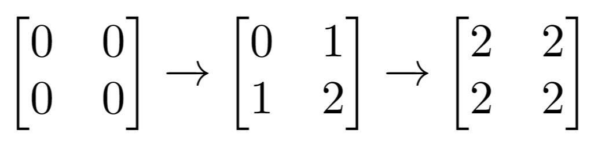

<h1>奇数值单元格的数目</h1>

给你一个m x n的矩阵，最开始的时候，每个单元格中的值都是0。 
另有一个二维索引数组indices，indices[i] = [ri, ci]指向矩阵中的某个位置，其中ri和ci分别表示指定的行和列（从0开始编号）。 
对indices[i]所指向的每个位置，应同时执行下述增量操作： 
ri行上的所有单元格，加1。 
ci列上的所有单元格，加1。 
给你m、n和indices。请你在执行完所有indices指定的增量操作后，返回矩阵中奇数值单元格的数目。 

示例1： 
   
输入：m = 2, n = 3, indices = [[0, 1], [1, 1]] 
输出：6 
解释：最开始的矩阵是[[0, 0, 0], [0, 0, 0]]。 
第一次增量操作后得到[[1, 2, 1], [0, 1, 0]]。 
最后的矩阵是[[1, 3, 1], [1, 3, 1]]，里面有6个奇数。 

示例2： 
   
输入：m = 2, n = 2, indices = [[1, 1], [0, 0]] 
输出：0 
解释：最后的矩阵是[[2, 2], [2, 2]]，里面没有奇数。 

提示： 
1 <= m, n <= 50 
1 <= indices.length <= 100 
0 <= ri < m 
0 <= ci < n 

进阶：你可以设计一个时间复杂度为O(n + m + indices.length)且仅用O(n + m)额外空间的算法来解决此问题吗？ 

[Link](https://leetcode.cn/problems/cells-with-odd-values-in-a-matrix/)