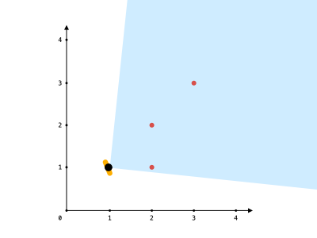

<h1>可见点的最大数目</h1>

给你一个点数组points和一个表示角度的整数angle，你的位置是location，其中location = [pos[x], pos[y]]且points[i] = [x[i], y[i]]都表示X-Y平面上的整数坐标。 
最开始，你面向东方进行观测。你不能进行移动改变位置，但可以通过自转调整观测角度。换句话说，pos[x]和pos[y]不能改变。你的视野范围的角度用angle表示，这决定了你观测任意方向时可以多宽。设d为你逆时针自转旋转的度数，那么你的视野就是角度范围[d - angle/2, d + angle/2]所指示的那片区域。 
 <video src="./video/angle.mp4" controls="controls" width="500" height="300"></video> 
对于每个点，如果由该点、你的位置以及从你的位置直接向东的方向形成的角度位于你的视野中，那么你就可以看到它。 
同一个坐标上可以有多个点。你所在的位置也可能存在一些点，但不管你的怎么旋转，总是可以看到这些点。同时，点不会阻碍你看到其他点。 
返回你能看到的点的最大数目。 

示例1： 
   
输入：points = [[2, 1], [2, 2], [3, 3]], angle = 90, location = [1, 1] 
输出：3 
解释：阴影区域代表你的视野。在你的视野中，所有的点都清晰可见，尽管[2, 2]和[3, 3]在同一条直线上，你仍然可以看到[3, 3]。 

示例2： 
输入：points = [[2, 1], [2, 2], [3, 4], [1, 1]], angle = 90, location = [1, 1] 
输出：4
解释：在你的视野中，所有的点都清晰可见，包括你所在位置的那个点。 

示例3： 
   
输入：points = [[1, 0], [2, 1]], angle = 13, location = [1, 1] 
输出：1 
解释：如图所示，你只能看到两点之一。 

提示： 
1 <= points.length <= 10^5 
points[i].length == 2 
location.length == 2 
0 <= angle < 360 
0 <= pos[x], pos[y], x[i], y[i] <= 100 

[Link](https://leetcode-cn.com/problems/maximum-number-of-visible-points/)