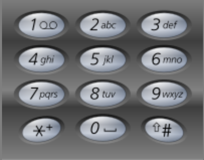

<h1>电话号码的字母组合</h1>

给定一个仅包含数字2-9的字符串，返回所有它能表示的字母组合。答案可以按任意顺序返回。 
给出数字到字母的映射如下（与电话按键相同）。注意1不对应任何字母。 
  

示例1： 
输入：digits = "23" 
输出：["ad", "ae", "af", "bd", "be", "bf", "cd", "ce", "cf"] 

示例2： 
输入：digits = "" 
输出：[] 

示例3： 
输入：digits = "2" 
输出：["a", "b", "c"] 

提示： 
0 <= digits.length <= 4 
digits[i]是范围['2', '9']的一个数字。 

[Link](https://leetcode-cn.com/problems/letter-combinations-of-a-phone-number/)