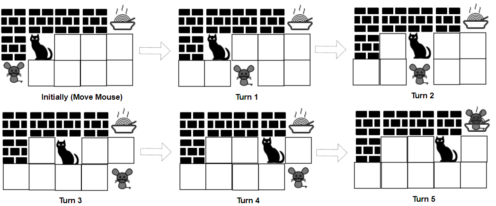

<h1>猫和老鼠II</h1>

一只猫和一只老鼠在玩一个叫做猫和老鼠的游戏。 
它们所处的环境设定是一个rows x cols的方格grid，其中每个格子可能是一堵墙、一块地板、一位玩家（猫或者老鼠）或者食物。 
- 玩家由字符'C'（代表猫）和'M'（代表老鼠）表示。 
- 地板由字符'.'表示，玩家可以通过这个格子。 
- 墙用字符'#'表示，玩家不能通过这个格子。 
- 食物用字符'F'表示，玩家可以通过这个格子。 
- 字符'C'，'M'和'F'在grid中都只会出现一次。 

猫和老鼠按照如下规则移动： 
- 老鼠先移动，然后两名玩家轮流移动。 
- 每一次操作时，猫和老鼠可以跳到上下左右四个方向之一的格子，他们不能跳过墙也不能跳出grid。 
- catJump和mouseJump是猫和老鼠分别跳一次能到达的最远距离，它们也可以跳小于最大距离的长度。 
- 它们可以停留在原地。 
- 老鼠可以跳跃过猫的位置。 

游戏有4种方式会结束： 
- 如果猫跟老鼠处在相同的位置，那么猫获胜。 
- 如果猫先到达食物，那么猫获胜。 
- 如果老鼠先到达食物，那么老鼠获胜。 
- 如果老鼠不能在1000次操作以内到达食物，那么猫获胜。 

给你rows x cols的矩阵grid和两个整数catJump和mouseJump，双方都采取最优策略，如果老鼠获胜，那么请你返回true，否则返回false。 
 
示例1： 
   
输入：grid = ["####F", "#C...", "M...."], catJump = 1, mouseJump = 2 
输出：true 
解释：猫无法抓到老鼠，也没法比老鼠先到达食物。 

示例2： 
   
输入：grid = ["M.C...F"], catJump = 1, mouseJump = 4 
输出：true 

示例3： 
输入：grid = ["M.C...F"], catJump = 1, mouseJump = 3 
输出：false 

示例4： 
输入：grid = ["C...#", "...#F", "....#", "M...."], catJump = 2, mouseJump = 5 
输出：false 

示例5： 
输入：grid = [".M...", "..#..", "#..#.", "C#.#.", "...#F"], catJump = 3, mouseJump = 1 
输出：true 

提示：
- rows == grid.length
- cols = grid[i].length
- 1 <= rows, cols <= 8
- grid[i][j]只包含字符'C'，'M'，'F'，'.'和'#'。
- grid中只包含一个'C'，'M'和'F'。
- 1 <= catJump, mouseJump <= 8

[Link](https://leetcode.cn/problems/cat-and-mouse-ii/)