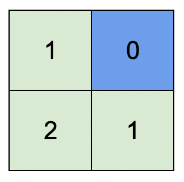
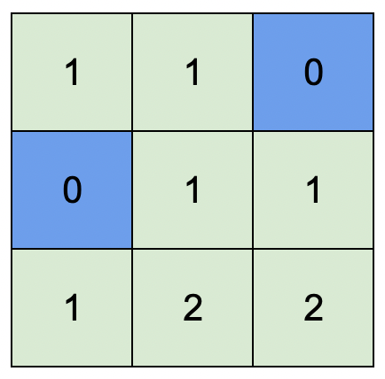

<h1>地图中的最高点</h1>

给你一个大小为m x n的整数矩阵isWater，它代表了一个由陆地和水域单元格组成的地图。 
如果isWater[i][j] == 0，格子(i, j)是一个陆地格子。 
如果isWater[i][j] == 1，格子(i, j)是一个水域格子。 
你需要按照如下规则给每个单元格安排高度： 
每个格子的高度都必须是非负的。 
如果一个格子是是水域，那么它的高度必须为0。 
任意相邻的格子高度差至多为1。当两个格子在正东、南、西、北方向上相互紧挨着，就称它们为相邻的格子。（也就是说它们有一条公共边） 
找到一种安排高度的方案，使得矩阵中的最高高度值最大。 
请你返回一个大小为m x n的整数矩阵height，其中height[i][j]是格子(i, j)的高度。如果有多种解法，请返回任意一个。 

示例1： 
   
输入：isWater = [[0, 1], [0, 0]] 
输出：[[1, 0], [2, 1]] 
解释：图1.png展示了给各个格子安排的高度。 
蓝色格子是水域格，绿色格子是陆地格。 

示例2： 
   
输入：isWater = [[0, 0, 1], [1, 0, 0], [0, 0, 0]] 
输出：[[1, 1, 0], [0, 1, 1], [1, 2, 2]] 
解释：所有安排方案中，最高可行高度为2。 
任意安排方案中，只要最高高度为2且符合上述规则的，都为可行方案。 

提示：
- m == isWater.length
- n == isWater[i].length
- 1 <= m, n <= 1000
- isWater[i][j]要么是0，要么是1。
- 至少有1个水域格子。

[Link](https://leetcode-cn.com/problems/map-of-highest-peak/)