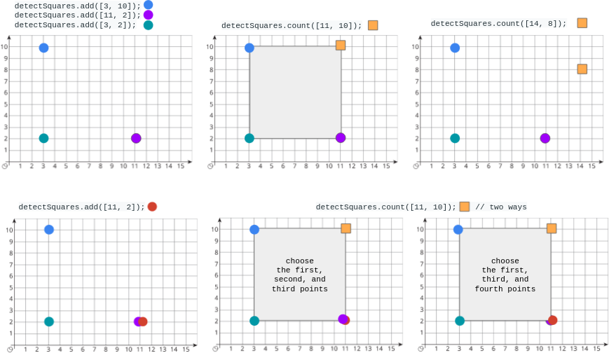

<h1>检测正方形</h1>

给你一个在X-Y平面上的点构成的数据流。设计一个满足下述要求的算法： 
添加一个在数据流中的新点到某个数据结构中。可以添加重复的点，并会视作不同的点进行处理。 
给你一个查询点，请你从数据结构中选出三个点，使这三个点和查询点一同构成一个面积为正的轴对齐正方形，统计满足该要求的方案数目。 
轴对齐正方形是一个正方形，除四条边长度相同外，还满足每条边都与x-轴或y-轴平行或垂直。 

实现DetectSquares类： 
DetectSquares()使用空数据结构初始化对象 
void add(int[] point)向数据结构添加一个新的点point = [x, y] 
int count(int[] point)统计按上述方式与点point = [x, y]共同构造轴对齐正方形的方案数。 

示例： 

输入： 
["DetectSquares", "add", "add", "add", "count", "count", "add", "count"] 
[[], [[3, 10]], [[11, 2]], [[3, 2]], [[11, 10]], [[14, 8]], [[11, 2]], [[11, 10]]] 
输出： 
[null, null, null, null, 1, 0, null, 2] 

解释： 
DetectSquares detectSquares = new DetectSquares(); 
detectSquares.add([3, 10]); 
detectSquares.add([11, 2]); 
detectSquares.add([3, 2]); 
detectSquares.count([11, 10]); // 返回 1 。你可以选择： 
//   - 第一个，第二个，和第三个点 
detectSquares.count([14, 8]);  // 返回 0 。查询点无法与数据结构中的这些点构成正方形。 
detectSquares.add([11, 2]);    // 允许添加重复的点。 
detectSquares.count([11, 10]); // 返回 2 。你可以选择： 
//   - 第一个，第二个，和第三个点 
//   - 第一个，第三个，和第四个点 

提示： 
point.length == 2 
0 <= x, y <= 1000 
调用add和count的总次数最多为5000 

[Link](https://leetcode-cn.com/problems/detect-squares/)