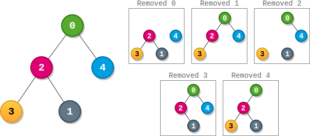
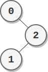

<h1>统计最高分的节点数目</h1>

给你一棵根节点为0的二叉树，它总共有n个节点，节点编号为0到n - 1。同时给你一个下标从0开始的整数数组parents表示这棵树，其中parents[i]是节点i的父节点。由于节点0是根，所以parents[0] == -1。 
一个子树的大小为这个子树内节点的数目。每个节点都有一个与之关联的分数。求出某个节点分数的方法是，将这个节点和与它相连的边全部删除，剩余部分是若干个非空子树，这个节点的分数为所有这些子树大小的乘积。
请你返回有最高得分节点的数目。 

示例1: 
 
输入：parents = [-1, 2, 0, 2, 0] 
输出：3 
解释：
- 节点0的分数为：3 * 1 = 3
- 节点1的分数为：4 = 4
- 节点2的分数为：1 * 1 * 2 = 2
- 节点3的分数为：4 = 4
- 节点4的分数为：4 = 4 
  最高得分为4，有三个节点得分为4（分别是节点1，3和4）。 

示例2： 
 
输入：parents = [-1, 2, 0] 
输出：2 
解释：
- 节点0的分数为：2 = 2
- 节点1的分数为：2 = 2
- 节点2的分数为：1 * 1 = 1
  最高分数为2，有两个节点分数为2（分别为节点0和1）。 

提示： 
n == parents.length 
2 <= n <= 10^5 
parents[0] == -1 
对于i != 0，有0 <= parents[i] <= n - 1 
parents表示一棵二叉树。 

[Link](https://leetcode-cn.com/problems/count-nodes-with-the-highest-score/)