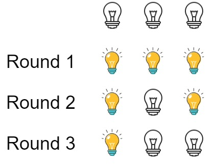

<h1>灯泡开关</h1>

初始时有n个灯泡处于关闭状态。第一轮，你将会打开所有灯泡。接下来的第二轮，你将会每两个灯泡关闭一个。 
第三轮，你每三个灯泡就切换一个灯泡的开关（即，打开变关闭，关闭变打开）。第i轮，你每i个灯泡就切换一个灯泡的开关。直到第n轮，你只需要切换最后一个灯泡的开关。 
找出并返回n轮后有多少个亮着的灯泡。 

示例1： 
   
输入：n = 3 
输出：1 
解释： 
初始时, 灯泡状态[关闭, 关闭, 关闭]. 
第一轮后, 灯泡状态[开启, 开启, 开启]. 
第二轮后, 灯泡状态[开启, 关闭, 开启]. 
第三轮后, 灯泡状态[开启, 关闭, 关闭]. 
你应该返回1，因为只有一个灯泡还亮着。 

示例2： 
输入：n = 0 
输出：0 

示例3： 
输入：n = 1 
输出：1 

提示：
- 0 <= n <= 10^9

[Link](https://leetcode-cn.com/problems/bulb-switcher/)