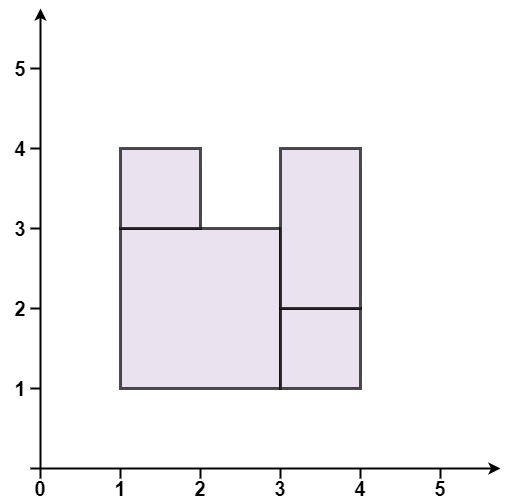

<h1>完美矩形</h1>

给你一个数组rectangles，其中rectangles[i] = [x[i], y[i], a[i], b[i]]表示一个坐标轴平行的矩形。这个矩形的左下顶点是(x[i], y[i])，右上顶点是(a[i], b[i])。 
如果所有矩形一起精确覆盖了某个矩形区域，则返回true；否则，返回false。 

示例1： 
   
输入：rectangles = [[1, 1, 3, 3], [3, 1, 4, 2], [3, 2, 4, 4], [1, 3, 2, 4], [2, 3, 3, 4]] 
输出：true 
解释：5个矩形一起可以精确地覆盖一个矩形区域。 

示例2： 
   
输入：rectangles = [[1, 1, 2, 3], [1, 3, 2, 4], [3, 1, 4, 2], [3, 2, 4, 4]] 
输出：false 
解释：两个矩形之间有间隔，无法覆盖成一个矩形。 

示例3： 
   
输入：rectangles = [[1, 1, 3, 3], [3, 1, 4, 2], [1, 3, 2, 4], [3, 2, 4, 4]] 
输出：false 
解释：图形顶端留有空缺，无法覆盖成一个矩形。 

示例4： 
   
输入：rectangles = [[1, 1, 3, 3], [3, 1, 4, 2], [1, 3, 2, 4], [2, 2, 4, 4]] 
输出：false 
解释：因为中间有相交区域，虽然形成了矩形，但不是精确覆盖。 

提示：
- 1 <= rectangles.length <= 2 * 10^4
- rectangles[i].length == 4
- -10^5 <= x[i], y[i], a[i], b[i] <= 10^5

[Link](https://leetcode-cn.com/problems/perfect-rectangle/)