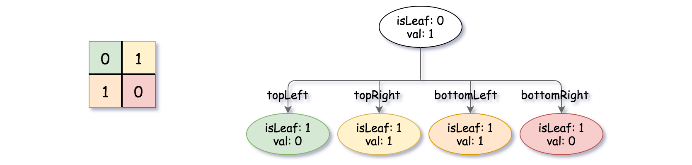

<h1>建立四叉树</h1>

给你一个n * n矩阵grid，矩阵由若干0和1组成。请你用四叉树表示该矩阵grid。</br>
你需要返回能表示矩阵的四叉树的根结点。</br>
注意，当isLeaf为False时，你可以把True或者False赋值给节点，两种值都会被判题机制接受。</br>
四叉树数据结构中，每个内部节点只有四个子节点。此外，每个节点都有两个属性：</br>
- val：储存叶子结点所代表的区域的值。1对应True，0对应False；</br>
- isLeaf: 当这个节点是一个叶子结点时为True，如果它有4个子节点则为False。</br>
```java
class Node {
    public boolean val;
    public boolean isLeaf;
    public Node topLeft;
    public Node topRight;
    public Node bottomLeft;
    public Node bottomRight;
}
```
我们可以按以下步骤为二维区域构建四叉树：
1. 如果当前网格的值相同（即，全为0或者全为1），将isLeaf设为True，将val设为网格相应的值，并将四个子节点都设为Null然后停止。</br>
2. 如果当前网格的值不同，将isLeaf设为False，将val设为任意值，然后如下图所示，将当前网格划分为四个子网格。</br>
3. 使用适当的子网格递归每个子节点。</br>
</br></br></br>
如果你想了解更多关于四叉树的内容，可以参考[wiki](https://en.wikipedia.org/wiki/Quadtree)。</br>
<b>四叉树格式:</b></br>
输出为使用层序遍历后四叉树的序列化形式，其中null表示路径终止符，其下面不存在节点。</br>
它与二叉树的序列化非常相似。唯一的区别是节点以列表形式表示[isLeaf, val]。</br>
如果isLeaf或者val的值为True，则表示它在列表[isLeaf, val]中的值为<b>1</b>；如果isLeaf或者val的值为False，则表示值<b>0</b>。</br>

示例1：</br>
</br></br></br>
输入：grid = [[0, 1], [1, 0]]</br>
输出：[[0, 1], [1, 0], [1, 1], [1, 1], [1, 0]]</br>
解释：此示例的解释如下：</br>
请注意，在下面四叉树的图示中，0表示false，1表示True。</br>
</br></br></br>

示例2：</br>
</br></br></br>
输入：grid = [[1, 1, 1, 1, 0, 0, 0, 0], [1, 1, 1, 1, 0, 0, 0, 0], [1, 1, 1, 1, 1, 1, 1, 1], [1, 1, 1, 1, 1, 1, 1, 1], [1, 1, 1, 1, 0, 0, 0, 0], [1, 1, 1, 1, 0, 0, 0, 0], [1, 1, 1, 1, 0, 0, 0, 0], [1, 1, 1, 1, 0, 0, 0, 0]]</br>
输出：[[0, 1], [1, 1], [0, 1], [1, 1], [1, 0], null, null, null, null, [1, 0], [1, 0], [1, 1], [1, 1]]</br>
解释：网格中的所有值都不相同。我们将网格划分为四个子网格。</br>
topLeft，bottomLeft和bottomRight均具有相同的值。</br>
topRight具有不同的值，因此我们将其再分为4个子网格，这样每个子网格都具有相同的值。</br>
解释如下图所示：</br>
</br></br></br>

示例3：</br>
输入：grid = [[1, 1], [1, 1]]</br>
输出：[[1, 1]]</br>

示例4：</br>
输入：grid = [[0]]</br>
输出：[[1, 0]]</br>

示例5：</br>
输入：grid = [[1, 1, 0, 0], [1, 1, 0, 0], [0, 0, 1, 1], [0, 0, 1, 1]]</br>
输出：[[0, 1], [1, 1], [1, 0], [1, 0], [1, 1]]</br>

提示：
1. n == grid.length == grid[i].length</br>
2. n == 2^x其中0 <= x <= 6</br>