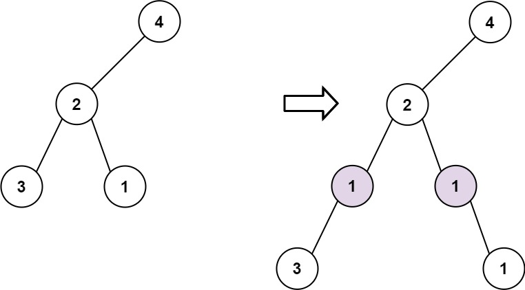

<h1>在二叉树中增加一行</h1>

给定一个二叉树的根root和两个整数val和depth，在给定的深度depth处添加一个值为val的节点行。 
注意，根节点root位于深度1。 

加法规则如下:
- 给定整数depth，对于深度为depth - 1的每个非空树节点cur，创建两个值为val的树节点作为cur的左子树根和右子树根。
- cur原来的左子树应该是新的左子树根的左子树。
- cur原来的右子树应该是新的右子树根的右子树。
- 如果depth == 1意味着depth - 1根本没有深度，那么创建一个树节点，值val作为整个原始树的新根，而原始树就是新根的左子树。

示例1: 
   
输入: root = [4, 2, 6, 3, 1, 5], val = 1, depth = 2 
输出: [4, 1, 1, 2, null, null, 6, 3, 1, 5] 

示例2: 
   
输入: root = [4, 2, null, 3, 1], val = 1, depth = 3 
输出: [4, 2, null, 1, 1, 3, null, null, 1] 

提示:
- 节点数在 [1, 10^4] 范围内
- 树的深度在 [1, 10^4]范围内
- -100 <= Node.val <= 100
- -10^5 <= val <= 10^5
- 1 <= depth <= the depth of tree + 1

[Link](https://leetcode.cn/problems/add-one-row-to-tree/)