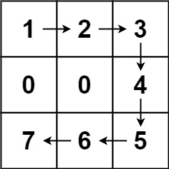

<h1>为高尔夫比赛砍树</h1>

你被请来给一个要举办高尔夫比赛的树林砍树。树林由一个m x n的矩阵表示，在这个矩阵中： 
- 0表示障碍，无法触碰 
- 1表示地面，可以行走 

比1大的数表示有树的单元格，可以行走，数值表示树的高度 
每一步，你都可以向上、下、左、右四个方向之一移动一个单位，如果你站的地方有一棵树，那么你可以决定是否要砍倒它。 
你需要按照树的高度从低向高砍掉所有的树，每砍过一颗树，该单元格的值变为1（即变为地面）。 
你将从(0, 0)点开始工作，返回你砍完所有树需要走的最小步数。如果你无法砍完所有的树，返回-1。 
可以保证的是，没有两棵树的高度是相同的，并且你至少需要砍倒一棵树。 

示例1： 
   
输入：forest = [[1, 2, 3], [0, 0, 4], [7, 6, 5]] 
输出：6 
解释：沿着上面的路径，你可以用6步，按从最矮到最高的顺序砍掉这些树。 

示例2： 
   
输入：forest = [[1, 2, 3], [0, 0, 0], [7, 6, 5]] 
输出：-1 
解释：由于中间一行被障碍阻塞，无法访问最下面一行中的树。 

示例3： 
输入：forest = [[2, 3, 4], [0, 0, 5], [8, 7, 6]] 
输出：6 
解释：可以按与示例1相同的路径来砍掉所有的树。 
(0, 0)位置的树，可以直接砍去，不用算步数。 

提示： 
m == forest.length 
n == forest[i].length 
1 <= m, n <= 50 
0 <= forest[i][j] <= 10^9 

[Link](https://leetcode.cn/problems/cut-off-trees-for-golf-event/)