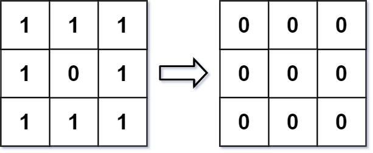

<h1>图像平滑器</h1>

图像平滑器r是大小为3 x 3的过滤器，用于对图像的每个单元格平滑处理，平滑处理后单元格的值为该单元格的平均灰度。
每个单元格的平均灰度定义为：该单元格自身及其周围的8个单元格的平均值，结果需向下取整。（即，需要计算蓝色平滑器中9个单元格的平均值）。
如果一个单元格周围存在单元格缺失的情况，则计算平均灰度时不考虑缺失的单元格（即，需要计算红色平滑器中4个单元格的平均值）。
  

给你一个表示图像灰度的m x n整数矩阵img，返回对图像的每个单元格平滑处理后的图像。

示例1:
  
输入: img = [[1, 1, 1], [1, 0, 1], [1, 1, 1]]
输出: [[0, 0, 0], [0, 0, 0], [0, 0, 0]]
解释:
对于点(0, 0), (0, 2), (2, 0), (2, 2): 平均(3 / 4) = 平均 (0.75) = 0
对于点(0, 1), (1, 0), (1, 2), (2, 1): 平均(5 / 6) = 平均 (0.83333333) = 0
对于点(1, 1): 平均 (8 / 9) = 平均 (0.88888889) = 0

示例2:
  
输入: img = [[100, 200, 100], [200, 50, 200], [100, 200, 100]]
输出: [[137, 141, 137], [141, 138, 141], [137, 141, 137]]
解释:
对于点(0, 0), (0, 2), (2, 0), (2, 2): floor((100 + 200 + 200 + 50) / 4) = floor(137.5) = 137
对于点(0, 1), (1, 0), (1, 2), (2, 1): floor((200 + 200 + 50 + 200 + 100 + 100) / 6) = floor(141.666667) = 141
对于点(1, 1): floor((50 + 200 + 200 + 200 + 200 + 100 + 100 + 100 + 100) / 9) = floor(138.888889) = 138

提示:
m == img.length
n == img[i].length
1 <= m, n <= 200
0 <= img[i][j] <= 255

[Link](https://leetcode-cn.com/problems/image-smoother/)