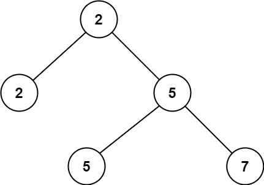

<h1>二叉树中第二小的节点</h1>

给定一个非空特殊的二叉树，每个节点都是正数，并且每个节点的子节点数量只能为2或0。如果一个节点有两个子节点的话，那么该节点的值等于两个子节点中较小的一个。 
更正式地说，root.val = min(root.left.val, root.right.val)总成立。 
给出这样的一个二叉树，你需要输出所有节点中的第二小的值。如果第二小的值不存在的话，输出-1。 

示例1： 
   
输入：root = [2, 2, 5, null, null, 5, 7] 
输出：5 
解释：最小的值是2，第二小的值是5。 

示例2： 
   
输入：root = [2, 2, 2] 
输出：-1 
解释：最小的值是2, 但是不存在第二小的值。 

提示： 
树中节点数目在范围[1, 25]内 
1 <= Node.val <= 2^31 - 1 
对于树中每个节点 root.val == min(root.left.val, root.right.val) 

[Link](https://leetcode-cn.com/problems/second-minimum-node-in-a-binary-tree/)