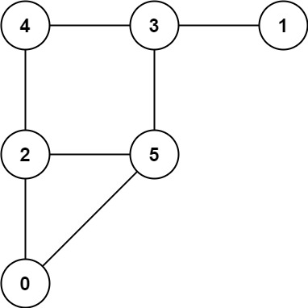

<h1>猫和老鼠</h1>

两位玩家分别扮演猫和老鼠，在一张无向图上进行游戏，两人轮流行动。 
图的形式是：graph[a]是一个列表，由满足ab是图中的一条边的所有节点b组成。 
老鼠从节点1开始，第一个出发；猫从节点2开始，第二个出发。在节点0处有一个洞。 
在每个玩家的行动中，他们必须沿着图中与所在当前位置连通的一条边移动。例如，如果老鼠在节点1，那么它必须移动到graph[1]中的任一节点。 
此外，猫无法移动到洞中（节点0）。 
然后，游戏在出现以下三种情形之一时结束： 
如果猫和老鼠出现在同一个节点，猫获胜。 
如果老鼠到达洞中，老鼠获胜。 
如果某一位置重复出现（即，玩家的位置和移动顺序都与上一次行动相同），游戏平局。 
给你一张图graph，并假设两位玩家都都以最佳状态参与游戏： 
如果老鼠获胜，则返回1； 
如果猫获胜，则返回2； 
如果平局，则返回0。 

示例1： 
   
输入：graph = [[2, 5], [3], [0, 4, 5], [1, 4, 5], [2, 3], [0, 2, 3]] 
输出：0 

示例2： 
   
输入：graph = [[1, 3], [0], [3], [0, 2]] 
输出：1 

提示： 
3 <= graph.length <= 50 
1<= graph[i].length < graph.length 
0 <= graph[i][j] < graph.length 
graph[i][j] != i 
graph[i]互不相同 
猫和老鼠在游戏中总是移动 

[Link](https://leetcode-cn.com/problems/cat-and-mouse/)